<div align="center">

# Low Polygon Image Generator

Turn a photo into a low-poly image made of flat-coloured triangles, written as an **SVG** (scalable, one `<polygon>` per triangle) or a **PNG**. An optional **relief mode** lights the triangles as if they had height, so the flat image looks 3D.

 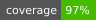
[](LICENSE)


</div>

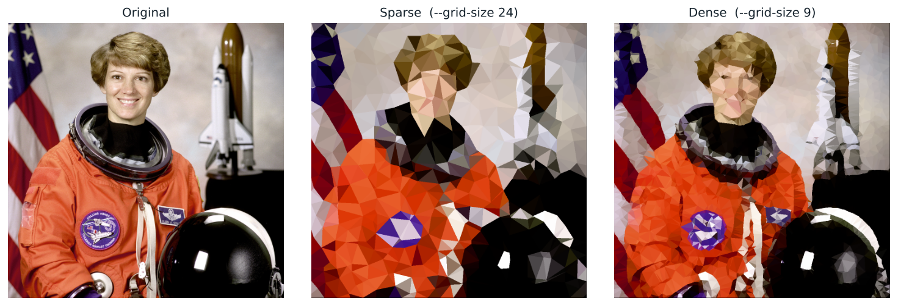

- [Install](#install) · [Quick start](#quick-start) · [Options](#options) · [Python API](#python-api)
- [How it works](#how-it-works) 
- [3D relief](#3d-relief-the-illusion-of-depth) (optional lighting that makes the image _hopefully_ look 3D)
- [Tuning guide](#tuning-guide) · [Samples](#samples) · [Limitations](#limitations)

## Install

Requires Python 3.9+.

```bash
git clone <your repo url> lowpoly && cd lowpoly
python3 -m venv .venv && source .venv/bin/activate      # optional
pip install -e .
```

This installs three dependencies (`numpy`, `opencv-python`, `scipy`) and the `lowpoly` command. Without installing, you can run `PYTHONPATH=src python3 -m lowpoly ...` from the repo root instead.

## Quick start

```bash
# One image to SVG, using the defaults
lowpoly photo.jpg out.svg

# Denser mesh (smaller cells = more triangles)
lowpoly photo.jpg out.svg --grid-size 10

# PNG instead, at 2x size
lowpoly photo.jpg out.png --grid-size 10 --scale 2

# A whole folder, to a folder of PNGs
lowpoly photos/ lowpoly_out/ --format png --grid-size 14

# For big photos shrink it first so the grid size means what you expect
lowpoly huge.jpg out.svg --max-size 1600 --grid-size 12

# 3D relief illusion (depth guessed from brightness, no extra install)
lowpoly photo.jpg out.png --grid-size 20 --relief 13
```

The output type comes from the extension (`.svg` or `.png`). The same options on the same image give the same result (the randomness is seeded).

```bash
PYTHONPATH=src python3 -m lowpoly path/to/image/cat.png test.png --grid-size 20    # macOS / Linux
```
```powershell
$env:PYTHONPATH="src"; py -m lowpoly path\to\image.png test.png --grid-size 20  # Windows PowerShell
```

**Common errors**

| Message | Cause | Fix |
|---|---|---|
| `lowpoly: error: Image not found: ...` | Wrong path, or you are not in the folder you think | Check the path in the message. Use the full path, or drag the file into the Terminal |
| `Permission denied reading ...` | macOS blocks the terminal app from reading that folder (Downloads, Desktop and Documents are protected) | System Settings > Privacy & Security > Files and Folders (or Full Disk Access): allow your terminal app, then restart it. Or copy the file elsewhere with Finder |
| `... is a HEIC file (judged by its content ...)` | iPhone/Apple photo, or a download saved as `.jpg` that is really HEIC or AVIF. The extension is not what decides | `sips -s format jpeg photo.jpg --out photo_fixed.jpg`, or Preview > File > Export |
| `... is empty (0 bytes)` | The download or copy failed | Download it again |
| `... looks like a JPEG file but could not be decoded` | The file is damaged or cut short | Download or export it again |
| `... is not a recognised image file` | A web page, text file or other format saved with an image name | Open it to check what it is; the message shows its first bytes |
| `unrecognized arguments: photo.png ...` | Unquoted spaces in a path | Put the path in quotes |
| `output must end in .svg or .png` | Output name has another extension, or none | Name the output `something.svg` or `something.png` |
| `ModuleNotFoundError: No module named 'cv2'` | Dependencies missing in this Python | `pip install -e .` using the same `python3` |
| Output looks too detailed or too coarse | Grid size does not match the photo size | Add `--max-size 1600`, then lower or raise `--grid-size` |

## Options

| Option | Default | What it does |
|---|---|---|
| `--grid-size N` | 25 | Cell size in pixels. One point per cell, so **smaller = more, smaller triangles**. The main quality knob. |
| `--jitter N` | 12 | Search radius for edge snapping, and the maximum random offset where there is no edge. |
| `--canny-low`, `--canny-high` | 100, 200 | Edge detector thresholds. Lower = more edges are found, so more points snap to contours. |
| `--saturation X` | 1.3 | Multiplies colour saturation. 1.0 leaves colours as they are. |
| `--color-mode` | `centroid` | `centroid`: colour from one pixel per triangle (fast). `mean`: average of all pixels inside (smoother, slower). |
| `--seed N` | 42 | Random seed. Change it for a different arrangement of the same image. |
| `--max-size N` | off | Downscale first so the longest side is at most N px. |
| `--scale N` | 1 | PNG only: output size multiplier. |
| `--format` | `svg` | Folder mode only: `svg` or `png`. |
| `--relief N` | 0 (off) | Turns on the 3D lighting. N is the height of the whole depth range as a percent of the image's longest side. Try 10 to 15. |
| `--depth-map FILE` | brightness guess | Greyscale depth image, **brighter = closer**. Replaces the brightness guess. Made with any tool you like. |
| `--light-angle D` | 315 | Where the light comes from, in compass degrees: 0 top, 90 right, 180 bottom, 270 left, 315 top left. |
| `--light-elevation D` | 55 | Light height above the image: 90 is straight on, lower is a raking light. |
| `--shading X` | 1.0 | Strength of the lighting, 0 to 1.5. |

Image sizes matter: `--grid-size 10` on a 400 px image and on a 4000 px image are very different looks. Use `--max-size`, or scale `--grid-size` with the image.

## How it works

Everything is six steps. Here they are on a real photo (grid size 14):

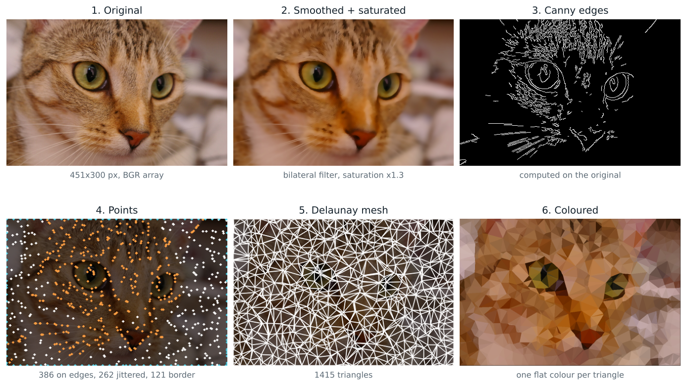

In the points panel, **orange** points were snapped onto an edge, **white** points were jittered randomly (no edge nearby) and **cyan** points are border anchors.

| # | Step | Function | Library |
|---|---|---|---|
| 1 | Read the image as an array | `load_image` | OpenCV |
| 2 | Smooth and boost saturation | `smooth` | OpenCV |
| 3 | Find edges | `detect_edges` | OpenCV |
| 4 | Choose points | `place_points` | NumPy |
| 5 | Connect them into triangles | `scipy.spatial.Delaunay` | SciPy |
| 6 | Colour each triangle, write output | `triangle_colors`, `Result.to_svg` / `to_png` | NumPy / OpenCV |

### 1. An image is an array

`cv2.imread` returns a NumPy array of shape `(height, width, 3)` with values 0 to 255 (`uint8`). Two details cause most beginner bugs:

- **Order is `[row, column]`, i.e. `img[y, x]`**, the reverse of how coordinates are usually written.
- **OpenCV stores channels as BGR**, not RGB. The code reverses them (`[:, ::-1]`) when writing colours into the SVG.

### 2. Smooth the image (bilateral filter)

Every triangle ends up as one flat colour, so noise and fine texture would make neighbouring triangles differ randomly. The image is smoothed first.

A Gaussian blur averages each pixel with its neighbours by *distance* only, so it blurs edges too. A **bilateral filter** multiplies two weights, distance and *colour difference*:

```
weight = exp(-distance² / 2σ_space²) × exp(-colour_difference² / 2σ_colour²)
```

A neighbour on the other side of an edge has a very different colour, so its weight is near zero and it barely contributes. Flat areas get smooth, edges stay sharp:

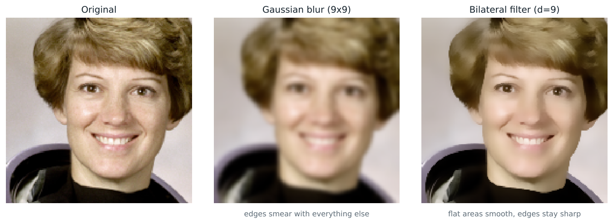

The code uses `d=9, sigmaColor=75, sigmaSpace=75`. Then colours are converted to HSV (hue, saturation, value) and saturation is multiplied by `--saturation`, because smoothing and averaging wash colours out. The multiplication is done in `float32` and clipped back to 0 to 255, since `uint8` arithmetic would wrap around (250 + 10 = 4).

### 3. Find the edges (Canny)

Canny marks the pixels where brightness changes sharply, in three stages:

1. **Gradient.** Sobel filters measure how fast brightness changes horizontally and vertically at every pixel.
2. **Thinning (non-maximum suppression).** Real edges are blurry, so the gradient is high across several pixels. Only the peak is kept, giving a line 1 pixel wide.
3. **Hysteresis thresholding.** Two thresholds, `low` and `high`:
   - above `high`: definitely an edge
   - below `low`: discarded
   - in between: kept only if connected to a definite edge

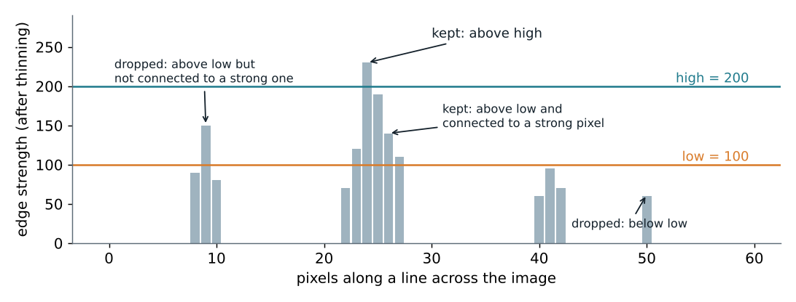

Two thresholds let faint continuations of a real outline survive while isolated weak specks (usually texture) are dropped. The result is a black-and-white map. The thresholds are the main tuning knob for this step:

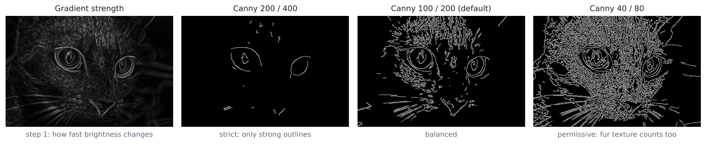

Edges are computed on the **original** image, not the smoothed one (`cv2.Canny` does no blurring of its own). Structure is measured on the untouched pixels, appearance on the cleaned ones.

### 4. Choose the points

This step gives the output its character. The image is divided into square cells of `grid_size`. Each cell contributes exactly one point:

```python
x1, x2 = max(0, cx - jitter), min(w, cx + jitter)   # a window around the cell centre
y1, y2 = max(0, cy - jitter), min(h, cy + jitter)
hits = np.argwhere(edges[y1:y2, x1:x2] > 0)          # edge pixels inside the window
if len(hits):                                        # an edge is nearby: use one
    ey, ex = hits[rs.randint(len(hits))]
    pts.append([x1 + ex, y1 + ey])
else:                                                # flat area: jittered cell centre
    pts.append([cx + rs.randint(-jitter, jitter + 1),
                cy + rs.randint(-jitter, jitter + 1)])
```

- **Edge pixels in the window**: one is picked at random and used as the point. The vertex sits on a real contour.
- **No edge nearby**: the point is the cell centre plus a random offset. The jitter breaks up the visible grid. Without it, flat areas look like a regular lattice:

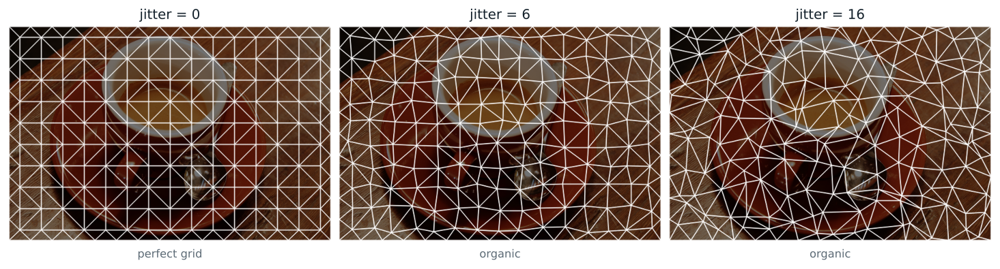

Snapping puts the triangles' corners on outlines; the jittered fallback keeps coverage even, so there are no large empty areas. The comparison below uses the same image and settings, with and without the edge map:

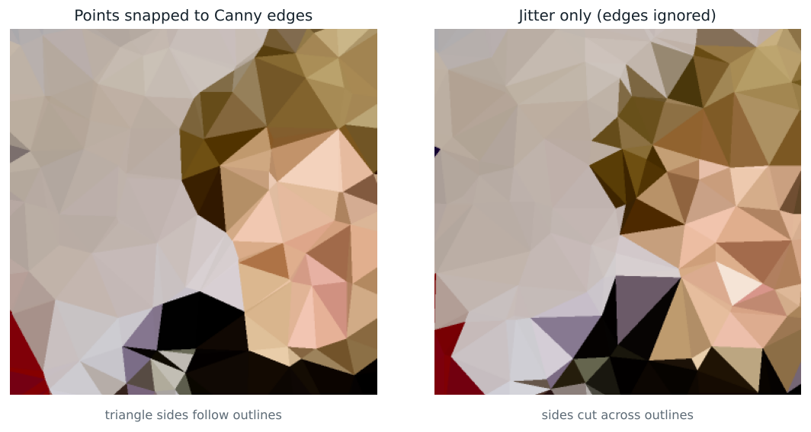

With edge snapping, triangle sides trace the outline of the hair and collar. With jitter only, sides cut across them and colours bleed over the outline.

`np.random.RandomState(seed)` makes the "random" choices repeatable.

**Detail worth knowing:** when `jitter` is larger than half of `grid_size`, neighbouring windows overlap, so two cells can choose the same edge pixel. Duplicates are removed with `np.unique`, so the final point count is lower than the cell count in edge-heavy regions.

**Border anchors.** Delaunay only covers the *convex hull* of its points. If no points lie on the image border, the mesh stops short of it and the outer triangles are long and skewed. So extra points are added along all four sides and at the four corners, forcing the hull to be exactly the image rectangle:

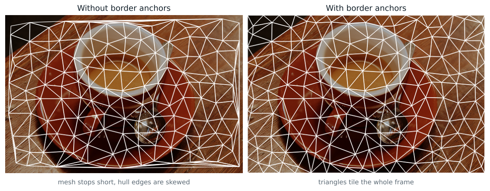

### 5. Connect the points (Delaunay triangulation)

Many different sets of triangles can connect the same points. **Delaunay** picks the set where **no point lies inside the circumscribed circle** (the circle through the three corners) of any triangle:

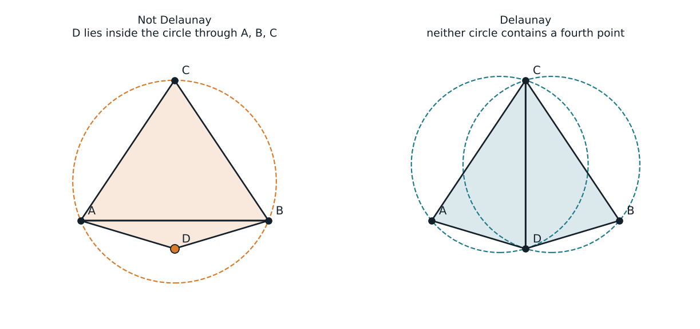

The practical effect is that the smallest angle in the mesh is as large as possible, so you get well-proportioned triangles and few thin slivers, which is what makes low-poly art look clean. `scipy.spatial.Delaunay(pts).simplices` is an `(m, 3)` array; each row holds three indices into the points array.

### 6. Colour each triangle and write the output

Each triangle gets one colour, sampled from the *smoothed* image. Two modes:

- `centroid` (default): the colour of the single pixel at the average of the three corners. Fast, but a one-pixel sample can be a stray bright or dark pixel.
- `mean`: the average of every pixel inside the triangle (a mask is drawn with `cv2.fillConvexPoly`). Smoother, and slower (see Limitations).

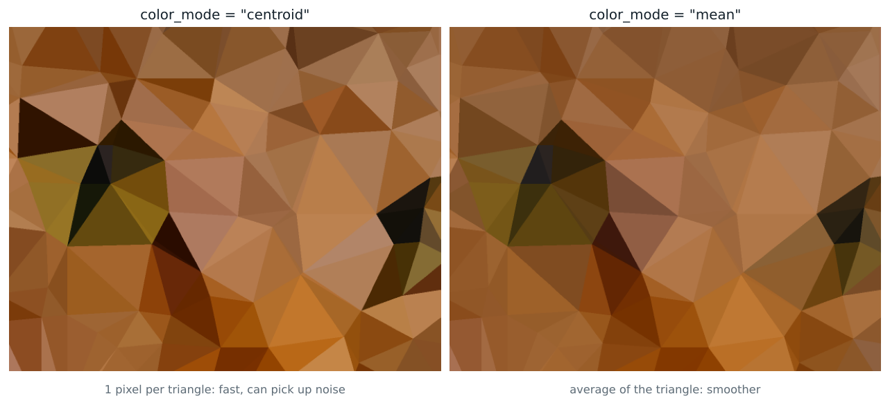

The difference is subtle at normal grid sizes; it shows most with large triangles over textured areas, as above.

**SVG** is a text format that describes shapes, so it scales to any size:

```xml
<!-- illustrative values -->
<svg xmlns="http://www.w3.org/2000/svg" viewBox="0 0 451 300" width="100%" height="100%">
  <polygon points="0,0 14,0 3,11" fill="rgb(180,128,98)" stroke="rgb(180,128,98)" stroke-width="0.5"/>
  ...
</svg>
```

- `viewBox` makes the coordinates equal to pixel positions, and `width/height="100%"` lets it fit any container.
- The **stroke** has the same colour as the fill. Neighbouring polygons are anti-aliased separately, which leaves faint hairline gaps; the stroke overlaps into the neighbours and hides them.

**PNG** is drawn directly with OpenCV (no SVG renderer needed): triangles are filled at 2x resolution, then averaged down, which gives smooth edges without seams.

### 3D relief: the illusion of depth

Real low-poly 3D art is a mesh of triangles that sit at different heights and catch light differently. You can fake that look without building any 3D object: give each triangle a height, work out how it tilts, and darken or brighten its flat colour as a light would. The image stays flat; only the colours change. Turn it on with `--relief`.

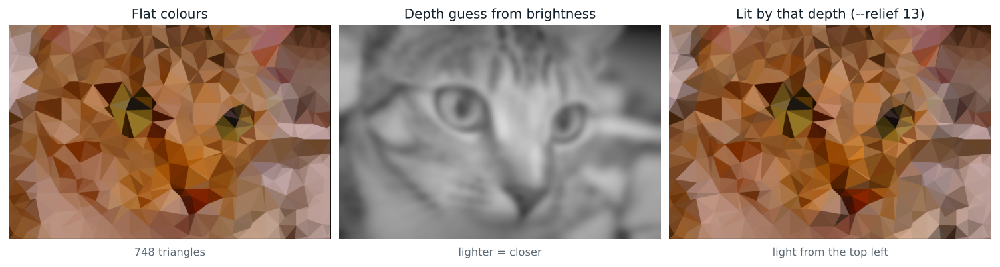

**1. A height for every triangle corner.** The corner's position gives x and y; the height `z` is read from a depth map (a greyscale image where brighter means closer) at that spot, scaled by `--relief`.

**2. The tilt of every triangle.** Three corners define a plane. Its normal (the direction it faces) is the cross product of two edges:

```python
n = np.cross(b - a, c - a)       # a, b, c are (x, y, z) corners
n /= np.linalg.norm(n)           # unit length
```

**3. Lambert shading.** Pick a light direction `L`. A surface facing the light is bright, one facing away is dark:

```
brightness = ambient + diffuse × max(0, n · L)
new colour = flat colour × brightness
```

`ambient` is 0.45, and `diffuse` is chosen so that a triangle facing straight at the viewer keeps exactly its original colour. Only tilted triangles change. `--light-angle` and `--light-elevation` set `L`:

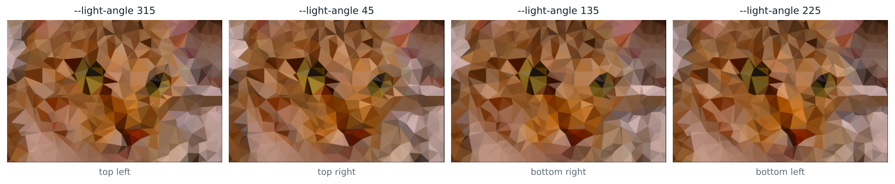

The lighting maths is geometric, so with a correct depth map it gives a believable object. Here a known dome (a hemisphere) is lit from two sides:

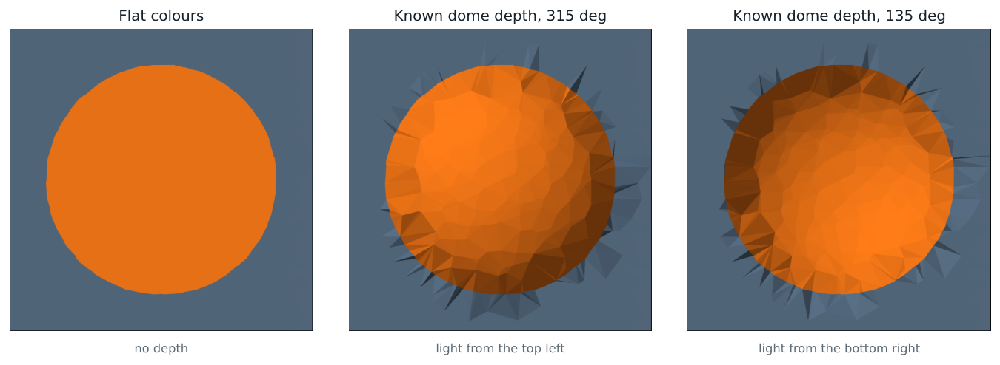

**Where the depth comes from** decides the result:

| Source | How | Quality |
|---|---|---|
| Brightness (default) | Blurred brightness plus a gentle bulge toward the centre. No extra install | A stylised guess. Dark things sink and pale things rise, which is often wrong (dark pupils look dented) |
| Your own depth map | `--depth-map file.png`, a greyscale image, brighter = closer | As good as the map. Any tool can produce one |

The project deliberately includes no neural depth model, so it needs no PyTorch. The tested paths are the brightness guess and `--depth-map`.

**Known artefacts**
- Triangles that straddle a sudden depth step (the edge of the dome above, a silhouette against a blurry background) can be long and thin, and they pick up the tilt of the step. This shows as dark or bright spikes around the subject. The tilt is capped at 60 degrees to limit it, and a smaller `--grid-size`, or points placed along depth edges, reduces it further. Placing points on depth edges is not implemented.
- Baked lighting multiplies the photo's own lighting. If the photo is lit from the left, use `--light-angle 270` or lower `--shading` so the two don't fight.
- It changes colours only. Triangle outlines and the silhouette stay flat, so the illusion is strongest on a subject with soft, rounded forms.

## Tuning guide

**`--grid-size`** controls detail. Smaller cells give more triangles and more detail, but past a point the image just looks like a noisy photo.

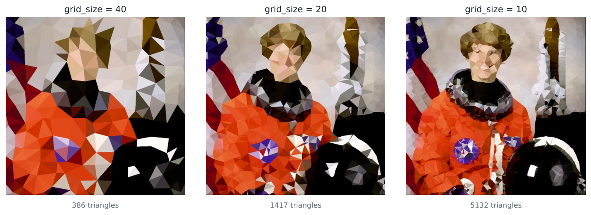

As a starting point, the sparse samples below use cells of about 4 to 5% of the image's longest side (24 px on a 450 to 640 px photo) and the dense ones about 1.5 to 2% (9 px). Scale from there to your image size.

**`--canny-low/high`** decide how much of the image counts as an edge. Raise them for clean, bold outlines; lower them to capture fine texture (hair, fur, foliage), at the cost of points crowding onto texture noise. Keep `high` at roughly 2x `low`.

**`--jitter`** has two effects: it is the random offset in flat areas (0 gives a rigid grid), and the radius in which a cell looks for an edge pixel to snap to. Above half of `--grid-size`, neighbouring cells' search windows overlap. The default of 12 was chosen for grid sizes around 10 to 25.

**`--saturation`**: 1.0 is faithful, 1.3 (default) compensates for smoothing, above 1.6 looks stylised.

**`--color-mode mean`** when you see stray off-colour triangles.

**`--relief`** (see [3D relief](#3d-relief-the-illusion-of-depth)): coarser meshes (`--grid-size` 20 to 28 on a 450 px image) read as faceted relief more clearly than very fine ones, where the shading turns into texture.

**`--seed`**: the mesh is random but repeatable. If one region looks unlucky, try another seed.

## Samples

Three versions of each sample are in [`samples/outputs/`](samples/outputs) (`*_sparse` = `--grid-size 24`, `*_dense` = `--grid-size 9`, `*_relief` = `--grid-size 20 --relief 13` with the brightness depth guess, each as `.svg` and `.png`).

**Portrait** (public domain, NASA)


**Animal** (CC0, Stefan van der Walt)
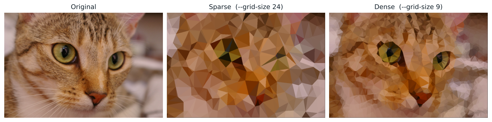

**Still life** (CC0, Rachel Michetti)
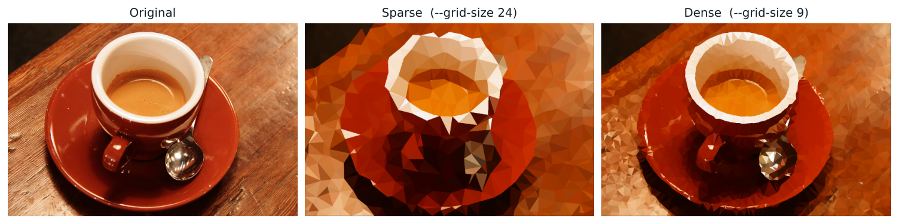

**Sky and structure** (public domain, SpaceX)
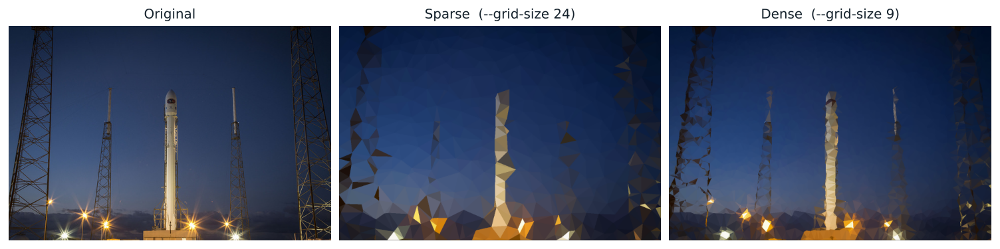

The input photos are the ones bundled with scikit-image and come with their licences documented there (see [`samples/inputs/SOURCES.md`](samples/inputs/SOURCES.md)). Reproduce any sample with:

```bash
lowpoly samples/inputs/cat.png cat.svg --grid-size 9
```

## Limitations

- **One scale for the whole image.** `--grid-size` is global, so a detailed face and a plain sky get the same number of points (edge snapping only moves them, it doesn't add or remove any).
- **Edges are approximated.** Triangle sides follow contours only where an edge point happened to be picked, so some outlines are cut across, especially thin or diagonal ones at coarse settings.
- **Centroid colouring can pick up noise.** Use `--color-mode mean` for a cleaner result.
- **Speed.** A 1920x1280 image takes about 0.3 s at `--grid-size 20` and 0.8 s at `--grid-size 10`; `mean` mode at grid 10 takes about 1.4 s. These are single measurements on one machine.
- **Dense SVGs are large.** 48,000 triangles is about 5 MB of text. Use PNG, or a larger grid size, for big images.
- **Relief is only as good as the depth map.** The default brightness guess is a stylised trick; see the artefacts listed under [3D relief](#3d-relief-the-illusion-of-depth) (BUG-009).

**Known defects** (details in [docs/BUG_LOG.md](docs/BUG_LOG.md)):
- **Edge strip (BUG-010).** The right column and bottom row of the output are not painted, because the mesh spans `(width-1) x (height-1)` and the canvas is `width x height`. The original script behaves the same way.
- **One-pixel-wide or tall images (BUG-011)** fail with a raw `QhullError` traceback instead of an error message.
- **`--color-mode mean` (BUG-012)** truncates instead of rounding, so colours can be one level too dark.
